# Outline

<!-- Abstract:
Modern datasets have made it possible to use genomic data to try to answer
increasingly detailed and practically relevant questions about evolution and ecology.
Although in many applications analytical inference methods are infeasible or not available,
simulation-based inference is possible for any system that can be simulated.
In this talk I will describe recent progress in simulating large, evolving populations,
and storing and analyzing the entire genomic history of these simulations (using SLiM and
the "tree sequence" data structure). I will then give two examples of applications: understanding
how the balance of different types of natural selection, mutation rate variation, and other processes
produced the landscapes of genetic diversity in the great apes; and describing conditions under which
coevolution can produce spatial correlations in phenotypes such as seen in the classic
Taricha newt-Thamnophis garter snake system.
-->

## Outline of the talk

1. Tree sequences, and simulations
2. Landscapes of genetic diversity
3. Spatial landscapes of coevolving traits

*slides:* [github.com/petrelharp/cornell-sep-2023](https://petrelharp.github.io/cornell-sep-2023/cornell-sep-2023.slides.html)

## Motivating questions

1. genetic diversity

2. newts and snakes

3. other things

# Inference, with genomes

##

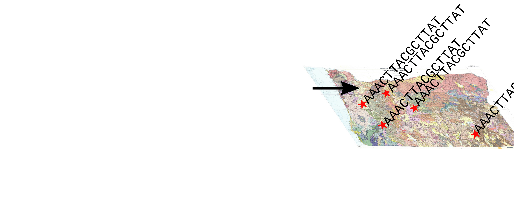

##

##

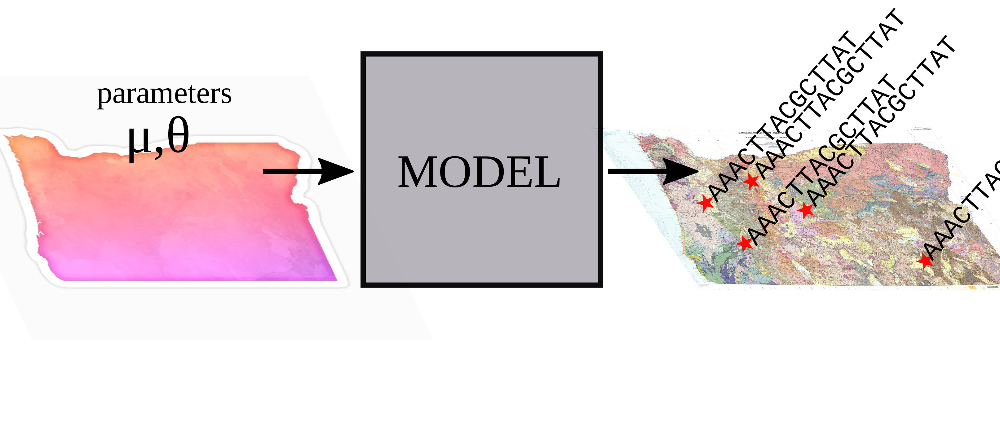

##

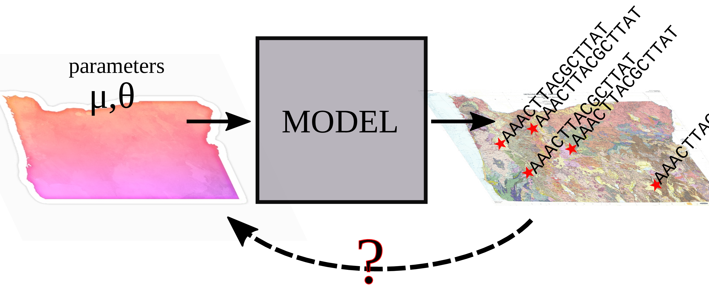

##

## Simulation-based inference

::: {.centered}
{width=60%}
:::

- bespoke confirmatory simulations
- optimization of one or two parameters
    <!-- *(if between-simulation noise is small)* -->
- Approximate Bayesian Computation (ABC)
- deep learning

# What do we need

##

1. Fast simulation of genomes

2. Fast computation of summary statistics

## Wish list:

::: {.smallish}

::: {.columns}
::::::: {.column}

Whole genomes,
thousands of samples, \
from millions of individuals.

**Demography:**

- life history 
- separate sexes
- selfing
- polyploidy
- species interactions

**Geography:**

- discrete populations
- continuous landscapes
- barriers

**History:**

- ancient samples
- range shifts

:::
::::::: {.column}

**Natural selection:**

- selective sweeps
- introgressing alleles
- background selection
- quantitative traits
- incompatibilities
- local adaptation

**Genomes:**

- recombination rate variation
- gene conversion
- infinite-sites mutation
- nucleotide models
- context-dependence
- mobile elements
- inversions
- copy number variation

:::
:::::::

:::

## Enter SLiM

::: {.columns}
::::::: {.column width=50%}

by Ben Haller and Philipp Messer

an individual-based, scriptable forwards simulator

:::: {.caption}

*Ben Haller*
::::

:::
::::::: {.column width=50%}

[messerlab.org/SLiM](https://messerlab.org/SLiM/)

:::
:::::::

##

::: {.smallish}

::: {.columns}
::::::: {.column}

- <s>Whole genomes,</s>*
- <s>thousands of samples, </s>
- <s>from millions of individuals.</s>*

**Demography:**

- <s>life history</s>
- <s>separate sexes</s>*
- <s>selfing</s>
- polyploidy*
- <s>species interactions</s>

**Geography:**

- <s>discrete populations</s>
- <s>continuous landscapes</s>
- <s>barriers</s>*

**History:**

- <s>ancient samples</s>
- <s>range shifts</s>

:::
::::::: {.column}

**Natural selection:**

- <s>selective sweeps</s>
- <s>introgressing alleles</s>
- <s>background selection</s>
- <s>quantitative traits</s>*
- <s>incompatibilities</s>*
- <s>local adaptation</s>*

**Genomes:**

- <s>recombination rate variation</s>
- <s>gene conversion</s>
- <s>infinite-sites mutation</s>
- <s>nucleotide models</s>
- <s>context-dependence</s>*
- mobile elements*
- inversions*
- copy number variation

:::
:::::::

:::

<!-- Tree sequences -->

# The tree sequence

## History is a sequence of trees

For a set of sampled chromosomes,
at each position along the genome there is a genealogical tree
that says how they are related.

. . .

----------------------

The **succinct tree sequence**

::: {.floatright}
is a way to succinctly describe this, er, sequence of trees

*and* the resulting genome sequences.

:::: {.caption}
[Kelleher, Etheridge, & McVean](http://journals.plos.org/ploscompbiol/article?id=10.1371/journal.pcbi.1004842) 
::::
:::

. . .

::: {.columns}
:::::: {.column width=50%}

{width=80%}

:::
:::::: {.column width=50%}

::: {.floatright}
{width=50%}

:::: {.caption}
jerome kelleher
::::

:::

:::
::::::

## How's it work? File sizes:

::: {.centered}
{width=90%}
:::

::: {.caption}
100Mb chromosomes;
from [Kelleher et al 2018, *Inferring whole-genome histories in large population datasets*](https://www.nature.com/articles/s41588-019-0483-y), Nature Genetics
:::

<!-- Estimated sizes of files required to store the genetic variation data for a
simulated human-like chromosome (100 megabases) for up to 10 billion haploid
(5 billion diploid) samples. Simulations were run for 10 1 up to 10 7 haplotypes
using msprime [Kelleher et al., 2016], and the sizes of the resulting files plotted
(points). -->

---------------

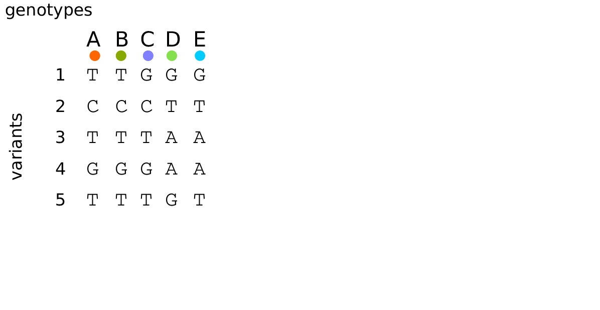

---------------

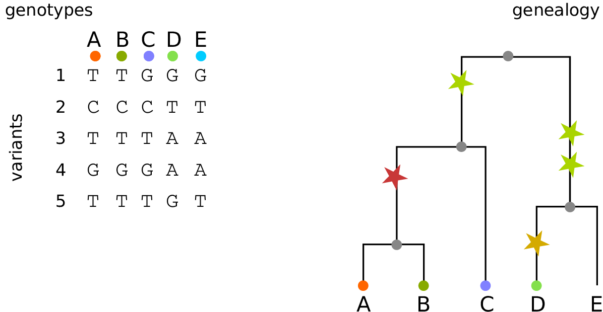

---------------

## For $N$ samples genotyped at $M$ sites

::: {.columns}
::::::: {.column width=50%}

*Genotype matrix*:

$N \times M$ things.

:::
::::::: {.column width=50%}

*Tree sequence:*

- $2N-2$ edges for the first tree
- $\sim 4$ edges per each of $T$ trees
- $M$ mutations

$O(N + T + M)$ things

:::
:::::::

{width=60%}

## How's it work, 2? Computation time:

::: {.centered}
{width=70%}
:::

::: {.caption}
from [R., Thornton and Kelleher 2019, *Efficiently summarizing relationships in large samples*](https://academic.oup.com/genetics/article/215/3/779/5930459), Genetics
:::

# Application to genomic simulations

## The main idea

If we *record the tree sequence*
that relates everyone to everyone else,

after the simulation is over we can put neutral mutations down on the trees.

. . .

Since neutral mutations don't affect demography,

this is *equivalent* to having kept track of them throughout.

------------

This means recording the entire genetic history of **everyone** in the population, **ever**.

.  . .

It is *not* clear this is a good idea.

. . .

But, with a few tricks...

. . .

:::: {.columns}
:::::::: {.column width=50%}

:::: {.caption}
From 
Kelleher, Thornton, Ashander, and R. 2018,
[Efficient pedigree recording for fast population genetics simulation](https://journals.plos.org/ploscompbiol/article?id=10.1371/journal.pcbi.1006581).

and Haller, Galloway, Kelleher, Messer, and R. 2018,
[*Tree‐sequence recording in SLiM opens new horizons for forward‐time simulation of whole genomes*](https://onlinelibrary.wiley.com/doi/abs/10.1111/1755-0998.12968)
:::

::::
:::::::: {.column width=50%}

::: {.floatright}
{width=35%}
{width=30%}
{width=30%}
:::

::::
::::::::

## A 100x speedup!

::: {.columns}
:::::: {.column width=40%}

::: {.centered}
{width=100%}
:::

:::
:::::: {.column width=60%}

::: {.floatright}
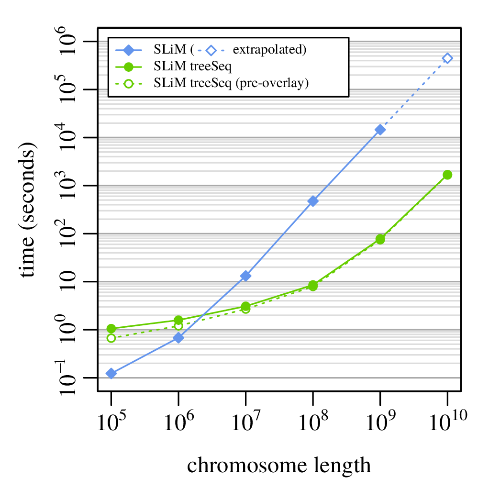{width=100%}
:::

:::
::::::

<!-- Great apes -->

# Landscapes of genetic diversity

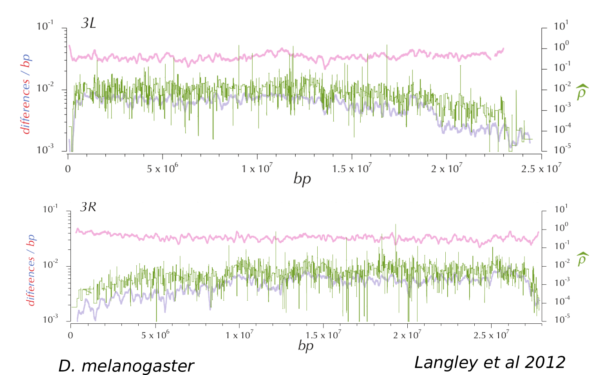

## Diversity correlates with recombination rate

:::: {.columns}
:::::::: {.column width=80%}

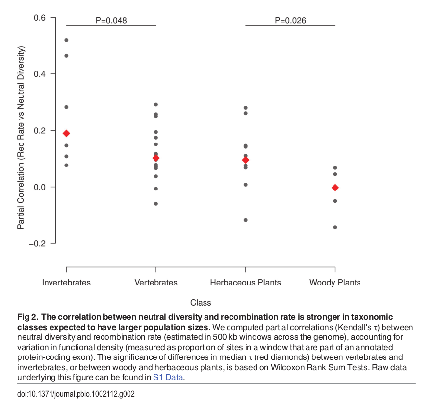{width=85%}

::::
:::::::: {.column width=20%}

*Hudson 1994; Cutter & Payseur 2013; Corbett-Detig et al 2015*

::::
::::::::

## Landscapes of genetic diverity within groups of species

::: {.caption .floatright}
[Stankowski, Chase et al. (2019)](https://journals.plos.org/plosbiology/article?id=10.1371/journal.pbio.3000391); [Van Doren et al. (2017)](https://onlinelibrary.wiley.com/doi/10.1111/mec.14083); [Buri (2017)](https://academic.oup.com/evlett/article/1/3/118/6697077)
:::

<!-- Divergence landscapes changing over time (from Murillo) -->

## How diversity landscapes change

:::: {.columns}
:::::::: {.column width=50%}

::::
:::::::: {.column width=50%}

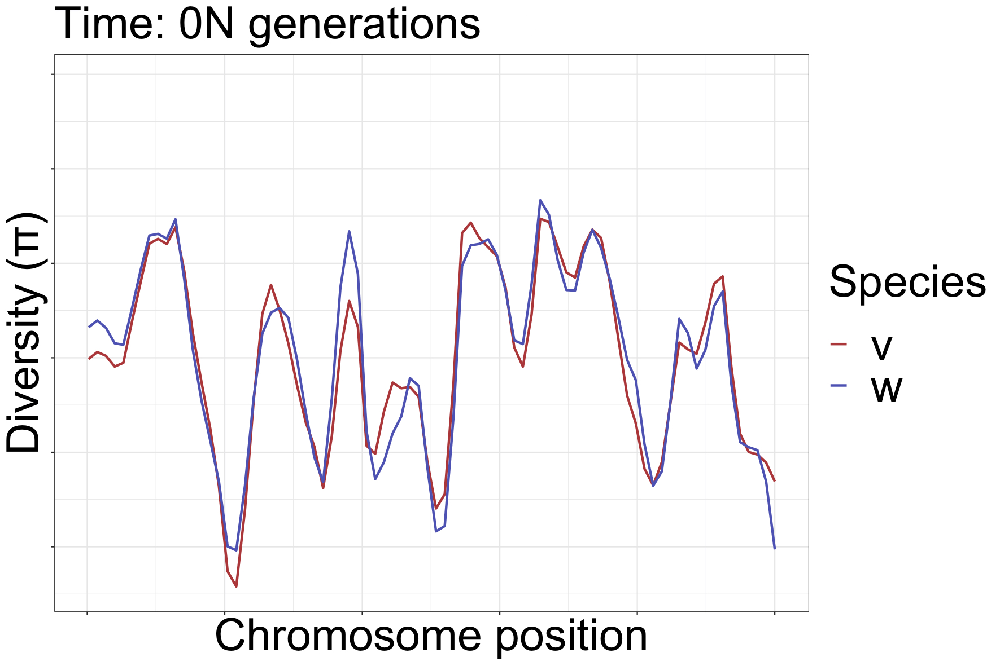

::::
::::::::

## How diversity landscapes change

:::: {.columns}
:::::::: {.column width=50%}

::::
:::::::: {.column width=50%}

::::
::::::::

## How diversity landscapes change

:::: {.columns}
:::::::: {.column width=50%}

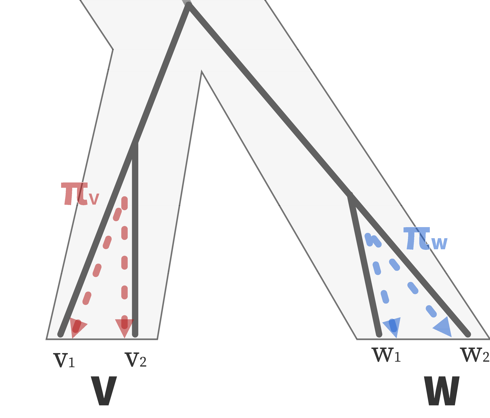

::::
:::::::: {.column width=50%}

::::
::::::::

## How can landscapes remain correlated?

:::: {.columns}
:::::::: {.column width=50%}

- shared ancestral variation
- shared processes:
    * positive, negative selection
    * mutation rate variation
    * GC-biased gene conversion

::::
:::::::: {.column width=50%}

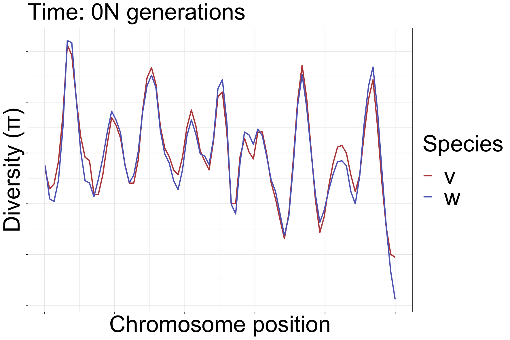

::::
::::::::

## How can landscapes remain correlated?

:::: {.columns}
:::::::: {.column width=50%}

- shared ancestral variation
- shared processes:
    * positive, negative selection
    * mutation rate variation
    * GC-biased gene conversion

::::
:::::::: {.column width=50%}

::::
::::::::

## How can landscapes remain correlated?

:::: {.columns}
:::::::: {.column width=50%}

- shared ancestral variation
- shared processes:
    * positive, negative selection
    * mutation rate variation
    * GC-biased gene conversion

::::
:::::::: {.column width=50%}

::::
::::::::

<!-- End divergence landscapes changing over time -->

## Goals

- How correlated are landscapes for closely related species?
- How much is due to shared footprints of
    * history?
    * selective forces?
    * mutational processes?

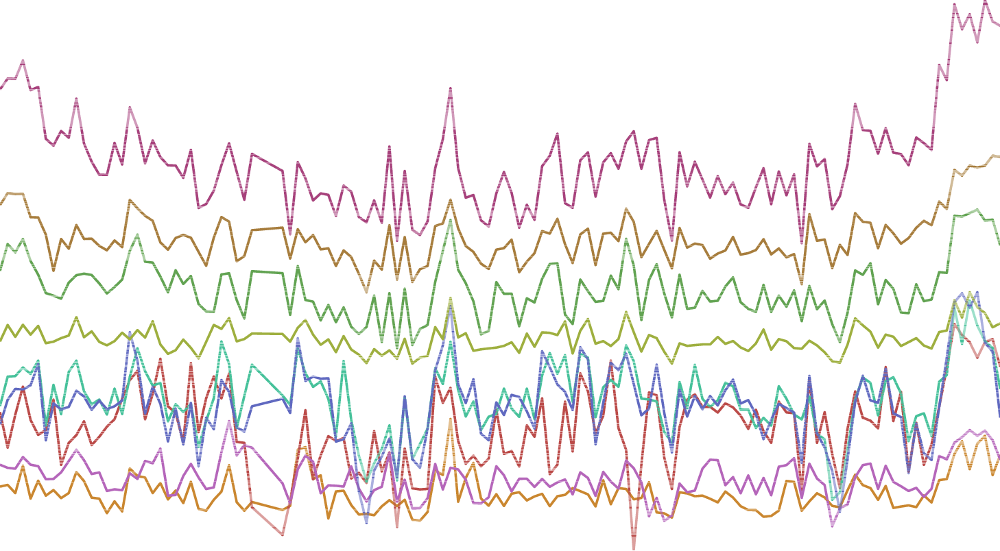{width=80%}

## The study system

:::: {.columns}
:::::::: {.column width=50%}

- High quality genomic data for 5 species
- Deep divergence, spanning ~60N generations
- Conservation of genes, recombination rate and other genomic features

::::
:::::::: {.column width=50%}

:::{.caption .flushright}
[Javier-Prado et al. (2013)](https://www.nature.com/articles/nature12228)
:::

::::
::::::::

##

##

##

## The data: empirical correlations for chromosome 12 in the great apes

## SLiMulations

:::: {.columns}
:::::::: {.column width=50%}

- Chromosome-scale simulation (chr12)
- selection on annotated exons (from Ensembl via [stdpopsim](https://popsim-consortium.github.io/stdpopsim-docs/main/catalog.html#sec_catalog_HomSap_annotations))
- branches simulated independently with SLiM and merged [tskit](https://tskit.dev/pyslim/docs/latest/vignette_parallel_phylo.html)

::::
:::::::: {.column width=50%}

::::
::::::::

-----------------

:::: {.columns}
:::::::: {.column width=30%}

::::
:::::::: {.column width=70%}

::::
::::::::

# Landscapes are not correlated with neutral simulation

:::: {.columns}
:::::::: {.column width=30%}

- correlations decay quickly with split time

::::
:::::::: {.column width=70%}

::::
::::::::

-----------------

:::: {.columns}
:::::::: {.column width=30%}

::::
:::::::: {.column width=70%}

::::
::::::::

## Mutation rate variation can contribute

:::: {.columns}
:::::::: {.column width=30%}

- but correlations do not decay with time

::::
:::::::: {.column width=70%}

::::
::::::::

## Negative selection produces weak correlations

:::: {.columns}
:::::::: {.column width=30%}

::::
:::::::: {.column width=70%}

::::
::::::::

## The *Mimulus aurantiacus* species complex

::: {.centered}

:::

---------------------

:::: {.columns}
:::::::: {.column width=80%}

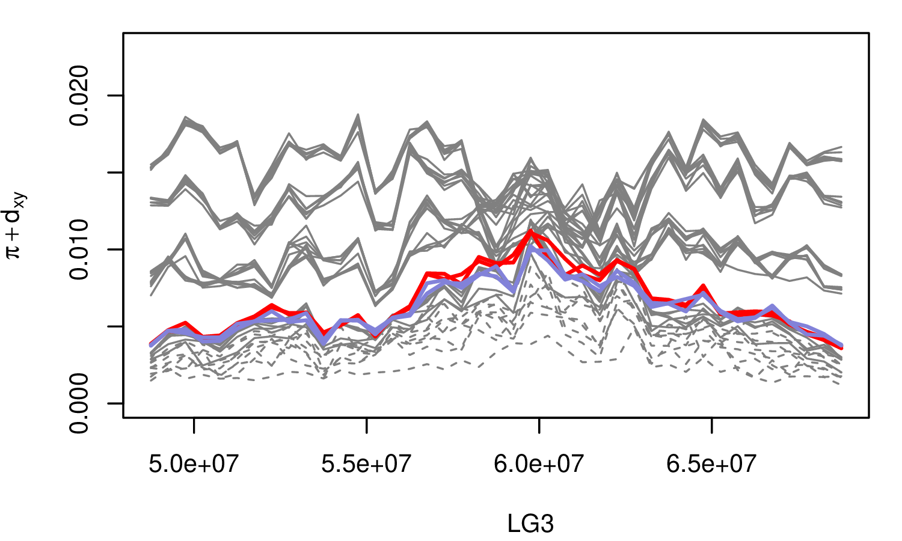

::::
:::::::: {.column width=20%}

{width="250%"}

::::
::::::::

## Simulations

::: {.columns}
::::::: {.column width="70%"}

- $N=10,000$ diploids
- burn-in for $10N$ generations
- population split, with either:
    
    * neutral
    * background selection
    * selection against introgressed alleles
    * positive selection
    * local adaptation

:::
::::::: {.column width="30%"}

:::: {.flushright}

::::: {.caption}
Murillo Rodrigues
:::::
::::

:::
:::::::

------------------

<!--
Fig 7. Genomic landscapes simulated under different divergence histories.
Each row of plots shows patterns of within- and between-population variation (π, dxy, and FST) across the chromosome (500-kb windows) at 5 time points (N generations, where N = 10,000) during one of the scenarios The selection parameter (Ns, where s = Ns/N), proportion of deleterious (−) and positive mutations (+), and number of migrants per generation (Nm; 0 unless stated) for these simulations are as follows: (i) neutral divergence (no selection), (ii) BGS (−Ns = 100; −prop = 0.1), (iii) BDMI (−Ns = 100, −prop = 0.05, Nm = 0.1), (iv) positive selection (+Ns = 100, +prop = 0.001), (v) BGS and positive selection (−Ns = 100, −prop = 0.1; +Ns = 100, +prop = 0.005), and (vi) local adaptation (+Ns = 100, +prop = 0.001, Nm = 0.1). The gray boxes in the first column show the areas of the chromosome that are experiencing selection, while the white central area evolves neutrally. Note that π (in populations a and b) and dxy have been mean centered so they can be viewed on the same scale. Uncentered values and additional simulations with different parameter combinations and more time points can be found in S13 Fig. BDMI, Bateson-Dobzhansky-Muller incompatibility; BGS, background selection.

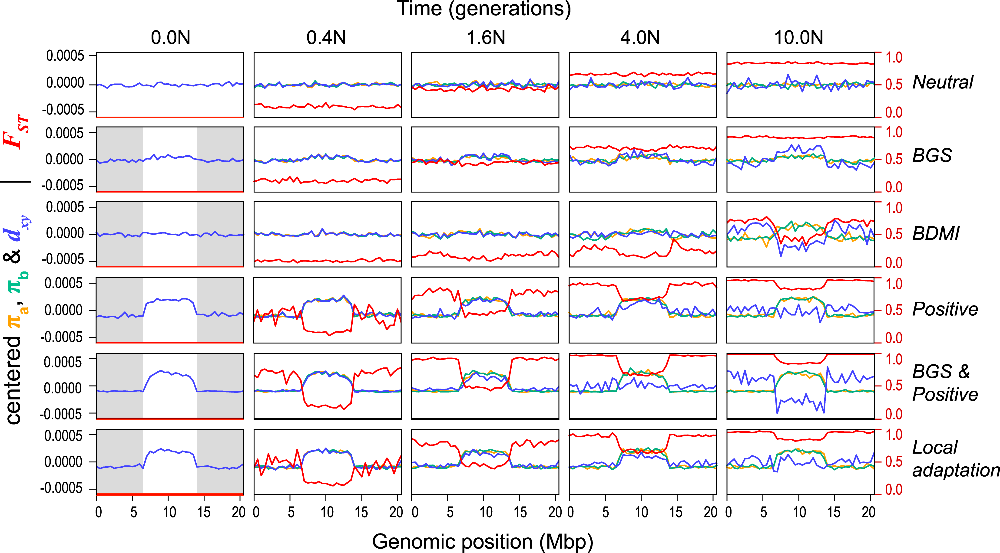
-->

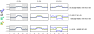{width=100%}

::::: {.flushright}

::::::::::: {.caption}
From [Widespread selection and gene flow shape the genomic landscape during a radiation of monkeyflowers](https://doi.org/10.1371/journal.pbio.3000391),
Stankowski, Chase, Fuiten, Rodrigues, Ralph, and Streisfeld;
PLoS Bio 2019.
:::::::::::
:::::

------------

Conclusions:

* <strike>neutral</strike>
* <strike>background selection</strike>
* <strike>selection against introgressed alleles</strike>
* positive selection
* local adaptation

::::: {.flushright}

::::::::::: {.caption}
From [Widespread selection and gene flow shape the genomic landscape during a radiation of monkeyflowers](https://doi.org/10.1371/journal.pbio.3000391),
Stankowski, Chase, Fuiten, Rodrigues, Ralph, and Streisfeld;
PLoS Bio 2019.
:::::::::::
:::::

<!-- Snewts -->

# Spatial coevolution: snakes and newts

:::: {.columns}
:::::::: {.column width=70%}

::::
:::::::: {.column width=30%}
::: {.centered}

{width=80%}

Victoria Caudill

:::
::::
::::::::

::::::::::: {.caption}
Image from [evolution.berkeley.edu](https://evolution.berkeley.edu/biological-warfare-and-the-coevolutionary-arms-race/coevolution/)
:::::::::::

---------------

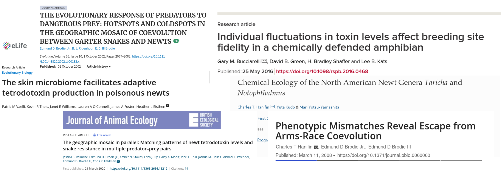

---------------

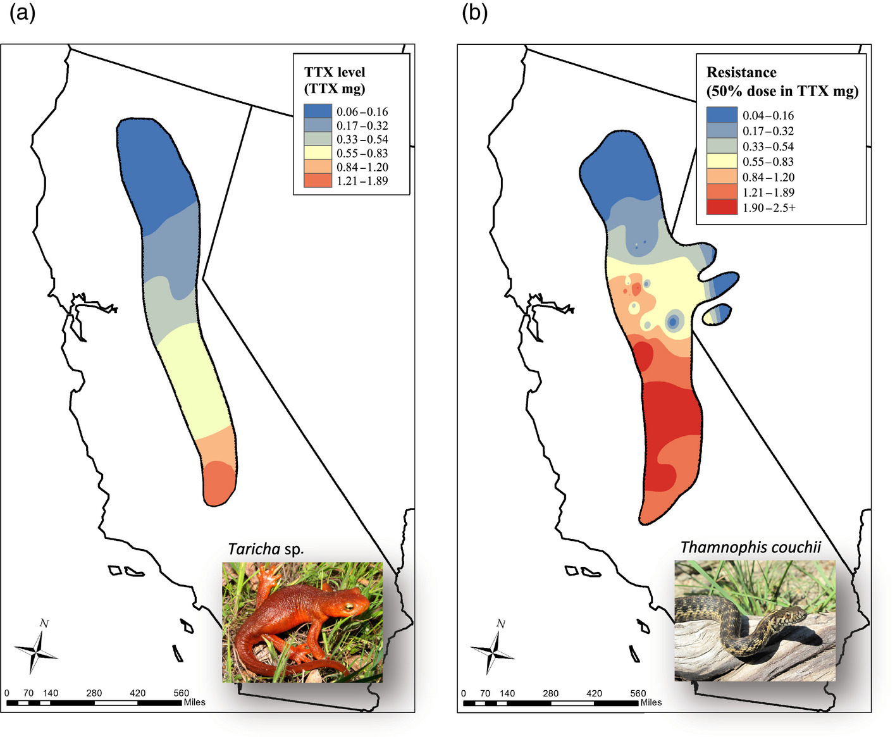{width=70%}

::::::::::: {.caption}
[Fig 1, Reimche et al 2020](https://besjournals.onlinelibrary.wiley.com/doi/full/10.1111/1365-2656.13212)
:::::::::::

---------------

{width=70%}

::::::::::: {.caption}
[Fig 2, Hanifin et al 2008](https://journals.plos.org/plosbiology/article?id=10.1371/journal.pbio.0060060)
:::::::::::

## Why, and how?

{width=100%}

## A spatial co-evolutionary simulation

:::: {.columns}
:::::::: {.column width=50%}

- continuous space
- local density-dependent mortality
- additive traits ("toxicity" and "resistance")
- various genetic architectures
- snakes may encounter nearby newts,
    outcome depends on difference in traits:

    * snake eats newt, gets fitness benefit, or
    * snake dies, newt escapes

::::
:::::::: {.column width=50%}

::::
::::::::
------------

:::: {.columns}
:::::::: {.column width=50%}

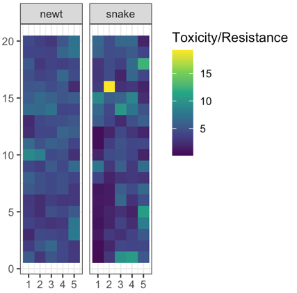

::::
:::::::: {.column width=50%}

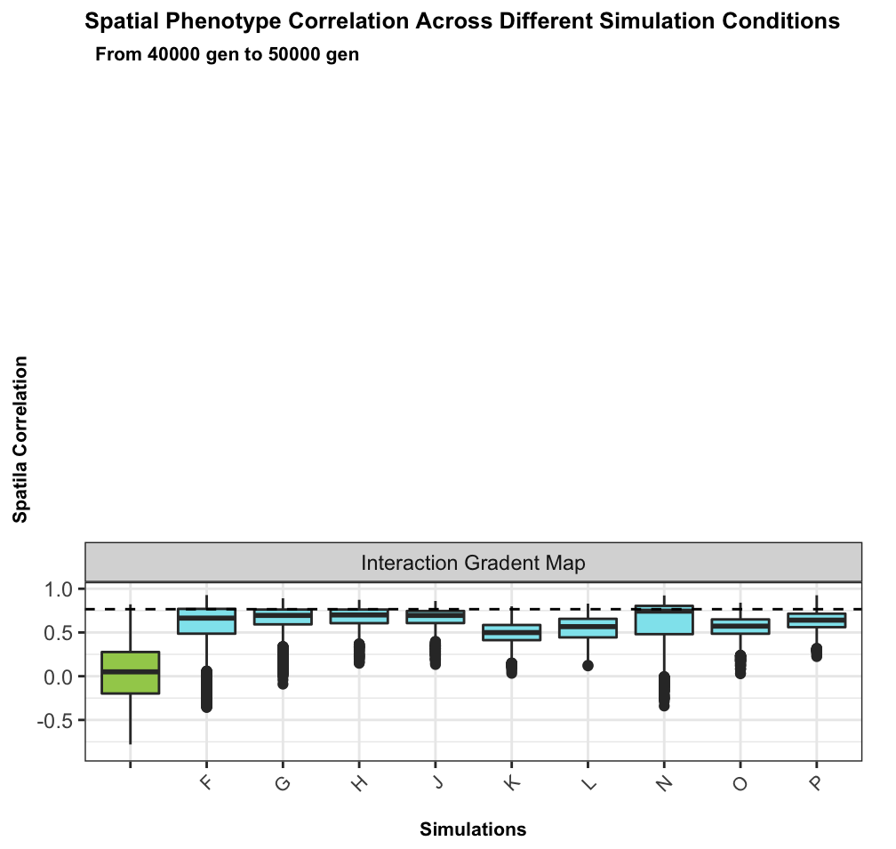

::::
::::::::

## Add some heterogeneity

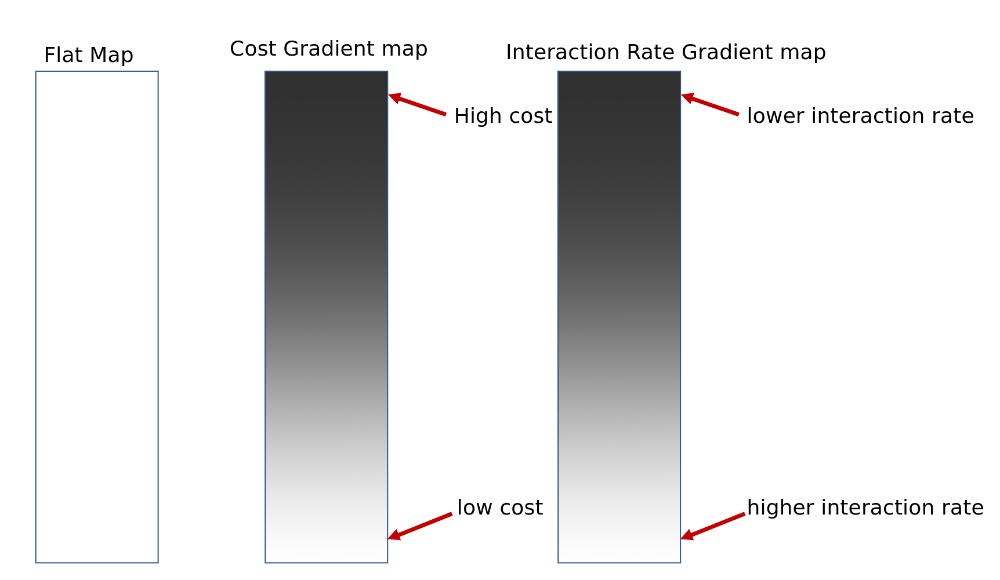

------------

:::: {.columns}
:::::::: {.column width=50%}

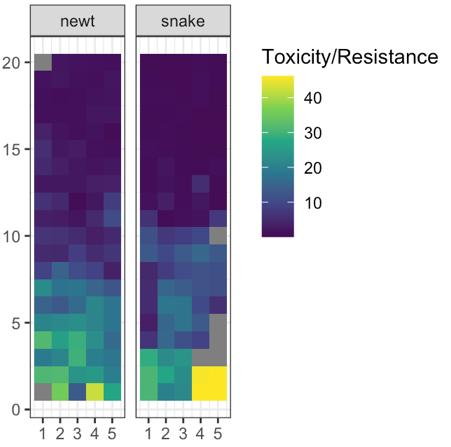

::::
:::::::: {.column width=50%}

::::
::::::::

## Conclusions

:::: {.columns}
:::::::: {.column width=50%}

::::
:::::::: {.column width=50%}

- such large correlated differences across the landscape
    unlikely to be due to nonadaptive forces

- spatial heterogeneity in ecological factors
    much more plausible

- trait genetic architecture has little effect,
    given sufficient variation

::: {.caption .floatright}
{width=20% .floatright}

Victoria Caudill
:::

::::
::::::::

# Wrap-up

## Software development goals

::: {.columns}
:::::: {.column width=50%}

- open
- welcoming and supportive
- reproducible and well-tested
- backwards compatible
- well-documented
- capacity building

::: {.centered}
{width=50%}
:::

:::
:::::: {.column width=50%}

::: {.centered}
{width=60%}

[tskit.dev](https://tskit.dev)

{width=80%}
:::

:::
::::::

## Thanks!

:::: {.columns}
:::::::: {.column width=50%}

- Andy Kern
- Matt Lukac
- Murillo Rodrigues 
- Victoria Caudill
- Nate Pope
- Gilia Patterson
- Anastasia Teterina
<!--
- Saurabh Belsare
- Chris Smith
- Gabby Coffing
- Jeff Adrion
-->
- CJ Battey
- Jared Galloway
- the rest of the Co-Lab

Funding:

- NIH NIGMS
- NSF DBI
- Sloan foundation
- UO Data Science

::::
:::::::: {.column width=50%}

- Jerome Kelleher
- Ben Haller
- Ben Jeffery
- Yan Wong
- Georgia Tsambos
- Jaime Ashander
- Gideon Bradburd
- Madeline Chase
- Bill Cresko
- Alison Etheridge
- Evan McCartney-Melstad
- Brad Shaffer
- Sean Stankowski
- Matt Streisfeld

::: {.floatright}
{width=40%}
{width=40%}
:::

::::
::::::::

## {data-background-image="figs/guillemots_thanks.png" data-background-position=center data-background-size=50%}
